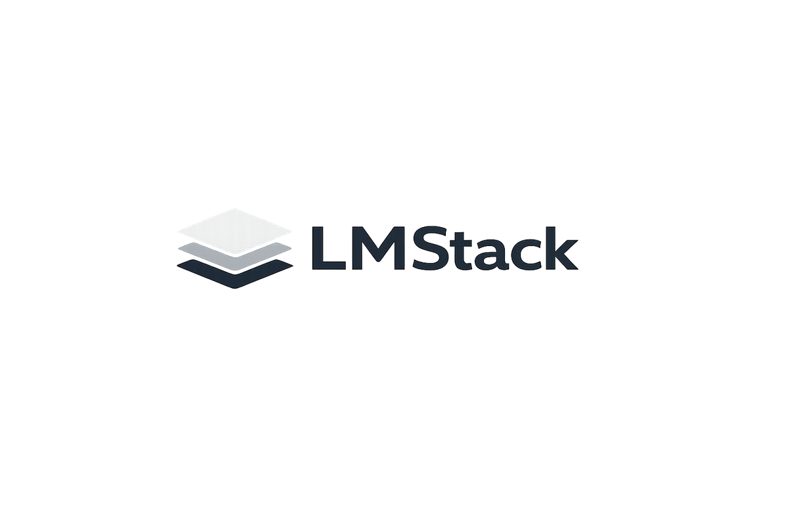

<p align="center">
  
</p>

<p align="center">
  <a href="README_zh-TW.md">中文文檔</a>
</p>

LLM Deployment Management Platform - Deploy and manage Large Language Models on distributed GPU workers.

## Features

- Web UI for managing workers, models, and deployments
- Support for **vLLM** and **Ollama** inference backends
- Docker-based worker agents for GPU nodes
- Real-time deployment status monitoring
- OpenAI-compatible API gateway

## Architecture

```
┌─────────────────┐     ┌─────────────────┐
│   Web Frontend  │────▶│   API Server    │
│   (React)       │     │   (FastAPI)     │
└─────────────────┘     └────────┬────────┘
                                │
                   ┌────────────┴────────────┐
                   ▼                         ▼
           ┌──────────────┐          ┌──────────────┐
           │ Worker Agent │          │ Worker Agent │
           │  (GPU Node)  │          │  (GPU Node)  │
           └──────────────┘          └──────────────┘
```

## Quick Start

### Prerequisites

- Docker
- Docker Compose V2: `sudo apt install docker-compose-v2`
- Docker permissions: `sudo usermod -aG docker $USER && newgrp docker`
- NVIDIA GPU with CUDA support
- NVIDIA Container Toolkit (install with `./scripts/install-nvidia-toolkit.sh`)

### Deploy with Docker Compose

```bash
# Deploy Backend + Frontend
docker compose -f docker-compose.deploy.yml up -d
```

- Frontend: http://localhost:3000
- Backend API: http://localhost:52000

### Usage

1. Login with `admin` / `admin` (change password after first login)
2. Go to **Workers** page and click **Add Worker** to get the Docker command
3. Run the Docker command on your GPU machine to register a worker
4. Add model in **Models** page
5. Create deployment in **Deployments** page
6. Use OpenAI-compatible API:

```bash
curl http://localhost:52000/v1/chat/completions \
  -H "Content-Type: application/json" \
  -H "Authorization: Bearer YOUR_API_KEY" \
  -d '{"model": "llama3.2:3b", "messages": [{"role": "user", "content": "Hello!"}]}'
```

## Development

### Local Docker Build

Build and run Docker images locally:

```bash
# Build all images
./scripts/build-local.sh

# Or build specific image
./scripts/build-local.sh backend
./scripts/build-local.sh frontend
./scripts/build-local.sh worker

# Run locally built backend + frontend
docker compose -f docker-compose.local.yml up -d
```

Then go to **Workers** page in the UI to add a worker.

### Without Docker

```bash
# Terminal 1 - Frontend
cd frontend
npm install
npm run dev

# Terminal 2 - Backend
cd backend
pip install -r requirements.txt
uvicorn app.main:app --host 0.0.0.0 --port 52000 --reload

# Terminal 3 - Worker (on GPU machine)
cd worker
pip install -r requirements.txt
python agent.py --name gpu-worker-01 --server-url http://YOUR_SERVER_IP:52000
```

## API Docs

- Swagger UI: http://localhost:52000/docs
- ReDoc: http://localhost:52000/redoc

## License

Apache-2.0
