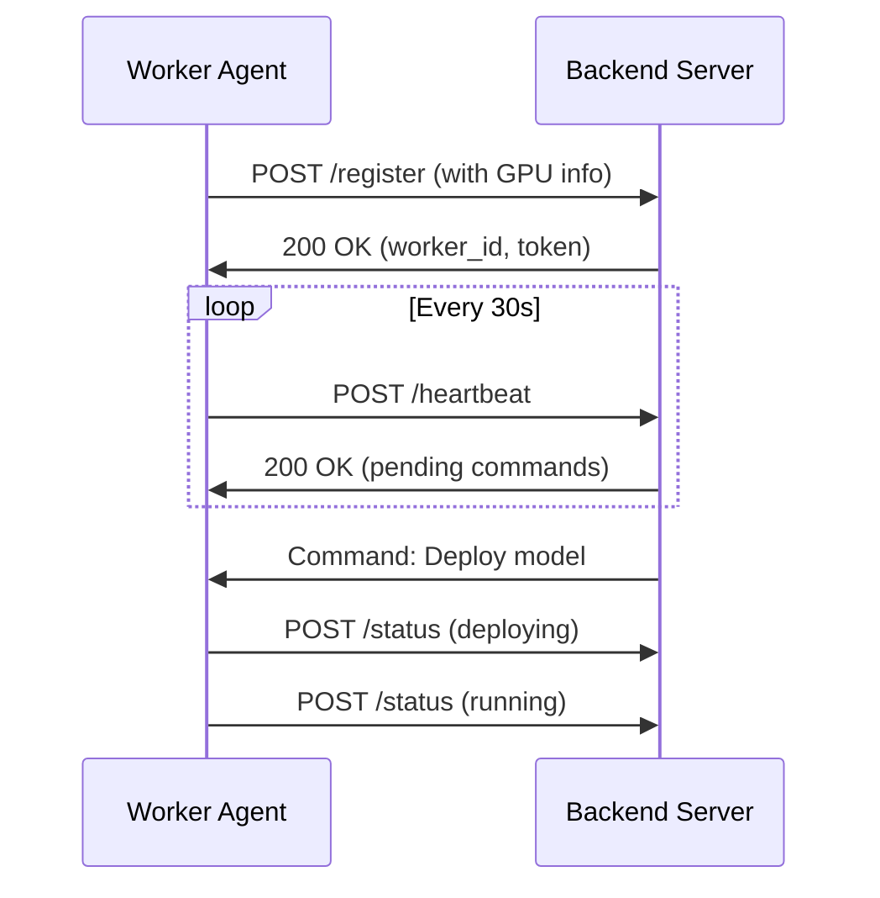

# Worker API

Internal API used for communication between the backend server and worker agents.

!!! note
    This API is for internal use. Worker agents communicate with the backend automatically.

## Overview

Workers register with the backend and receive commands to manage model deployments. The communication flow is:



## Worker Registration

### Register Worker

```http
POST /api/workers/register
```

Called when a worker agent starts up.

**Request Body:**

```json
{
  "name": "gpu-worker-01",
  "token": "worker-auth-token",
  "gpu_info": {
    "count": 2,
    "devices": [
      {
        "index": 0,
        "name": "NVIDIA A100-SXM4-80GB",
        "memory_total": 85899345920,
        "cuda_version": "12.1"
      }
    ]
  },
  "system_info": {
    "hostname": "gpu-server-01",
    "cpu_count": 64,
    "memory_total": 256000000000,
    "os": "Ubuntu 22.04"
  }
}
```

**Response:**

```json
{
  "worker_id": "uuid",
  "message": "Worker registered successfully"
}
```

## Heartbeat

### Send Heartbeat

```http
POST /api/workers/{worker_id}/heartbeat
```

Workers send heartbeats to maintain online status and receive commands.

**Request Body:**

```json
{
  "status": "online",
  "gpu_usage": [
    {
      "index": 0,
      "memory_used": 45000000000,
      "utilization": 85
    }
  ],
  "active_deployments": ["deployment-uuid-1", "deployment-uuid-2"]
}
```

**Response:**

```json
{
  "commands": [
    {
      "type": "deploy",
      "deployment_id": "uuid",
      "config": {}
    }
  ]
}
```

## Deployment Commands

### Deploy Model

Received via heartbeat response.

```json
{
  "type": "deploy",
  "deployment_id": "uuid",
  "backend": "vllm",
  "model": "meta-llama/Llama-2-7b-chat-hf",
  "config": {
    "gpu_memory_utilization": 0.9,
    "max_model_len": 4096,
    "port": 8001
  }
}
```

### Stop Deployment

```json
{
  "type": "stop",
  "deployment_id": "uuid"
}
```

## Status Updates

### Update Deployment Status

```http
POST /api/workers/{worker_id}/deployments/{deployment_id}/status
```

**Request Body:**

```json
{
  "status": "running",
  "container_id": "abc123",
  "port": 8001,
  "message": "Model loaded successfully"
}
```

**Status Values:**

| Status | Description |
|--------|-------------|
| `pending` | Deployment created, waiting to start |
| `downloading` | Pulling container image |
| `starting` | Container starting up |
| `running` | Model is ready and serving |
| `stopping` | Container is shutting down |
| `stopped` | Container stopped |
| `error` | Deployment failed |

## Container Operations

### Get Container Logs

```http
GET /api/workers/{worker_id}/containers/{container_id}/logs
```

**Query Parameters:**

| Parameter | Type | Description |
|-----------|------|-------------|
| `lines` | integer | Number of log lines |
| `since` | string | Timestamp to start from |

### List Images

```http
GET /api/workers/{worker_id}/images
```

**Response:**

```json
{
  "images": [
    {
      "id": "sha256:abc123",
      "tags": ["vllm/vllm-openai:latest"],
      "size": 15000000000,
      "created": "2024-01-01T00:00:00Z"
    }
  ]
}
```

### Pull Image

```http
POST /api/workers/{worker_id}/images/pull
```

**Request Body:**

```json
{
  "image": "vllm/vllm-openai:latest"
}
```

### Delete Image

```http
DELETE /api/workers/{worker_id}/images/{image_id}
```

## Storage Operations

### Get Disk Usage

```http
GET /api/workers/{worker_id}/storage/disk
```

**Response:**

```json
{
  "total": 1000000000000,
  "used": 450000000000,
  "free": 550000000000,
  "percent": 45.0
}
```

### Prune Docker Resources

```http
POST /api/workers/{worker_id}/storage/prune
```

**Request Body:**

```json
{
  "images": true,
  "containers": true,
  "volumes": false
}
```

**Response:**

```json
{
  "space_reclaimed": 5000000000
}
```

## Authentication

Worker requests are authenticated using the worker token:

```http
Authorization: Bearer WORKER_TOKEN
```

## Error Handling

Workers should handle errors gracefully and report status:

```json
{
  "status": "error",
  "error_code": "CONTAINER_FAILED",
  "message": "Container exited with code 1",
  "logs": "Error: CUDA out of memory..."
}
```
