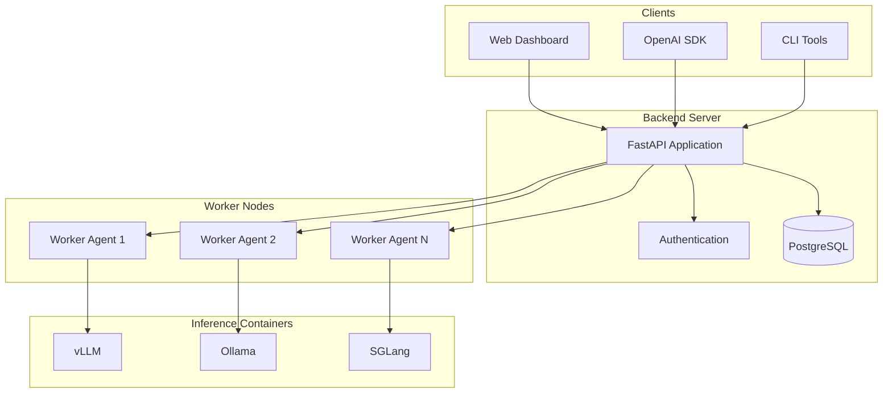
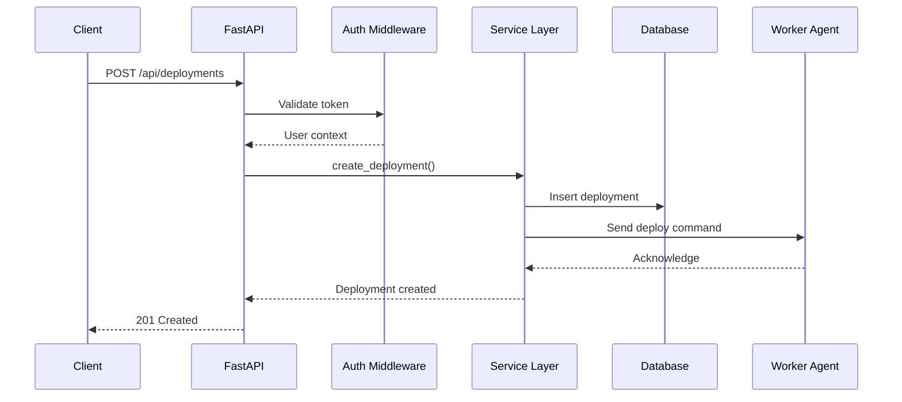
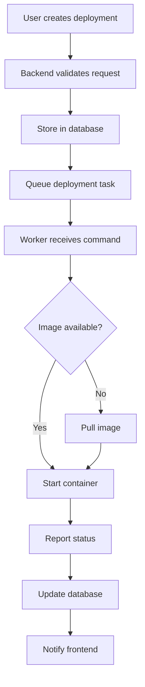
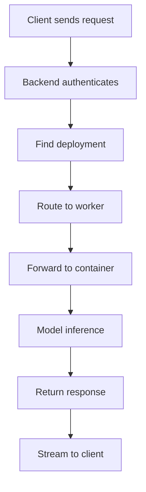
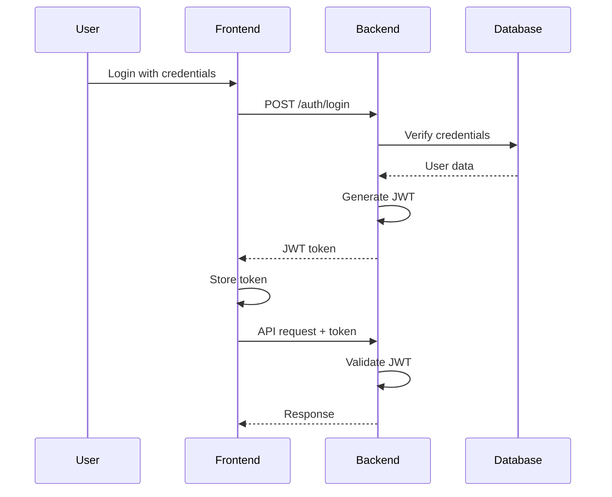
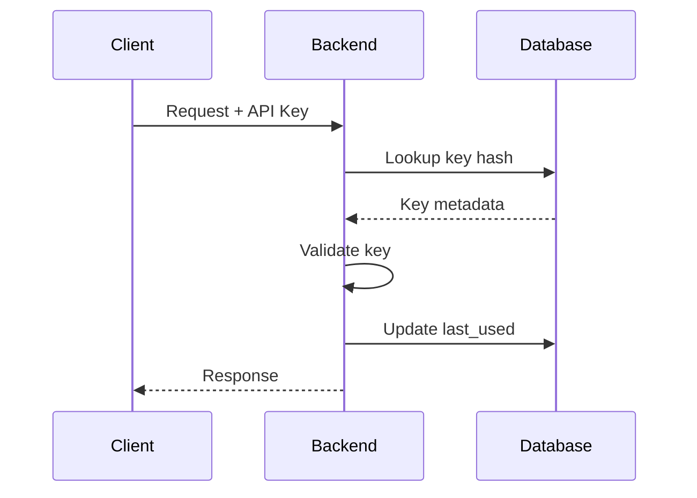

# Architecture

This document describes the architecture of LMStack.

## System Overview



## Components

### Backend Server

The backend is a FastAPI application that provides:

- **REST API**: Deployment management, worker management, user management
- **OpenAI-Compatible API**: `/v1/chat/completions`, `/v1/models`
- **WebSocket**: Real-time log streaming
- **Authentication**: JWT tokens and API keys

#### Directory Structure

```
backend/app/
├── api/                 # API endpoints
│   ├── apps/            # Application routes (modular)
│   │   ├── deployments.py
│   │   ├── workers.py
│   │   └── users.py
│   └── openai.py        # OpenAI-compatible endpoints
├── core/                # Core configuration
│   ├── config.py        # Settings
│   ├── security.py      # Auth utilities
│   └── database.py      # DB connection
├── models/              # SQLAlchemy models
├── schemas/             # Pydantic schemas
└── services/            # Business logic
```

#### Request Flow



### Frontend

React-based single-page application:

- **Ant Design**: UI component library
- **React Query**: Data fetching and caching
- **React Router**: Client-side routing

#### Directory Structure

```
frontend/src/
├── components/          # Reusable components
│   ├── chat/            # Chat interface
│   ├── logos/           # Brand logos
│   └── common/          # Shared components
├── pages/               # Page components
├── hooks/               # Custom hooks
├── utils/               # Utility functions
├── api/                 # API client
└── types/               # TypeScript types
```

### Worker Agent

Lightweight Python agent running on GPU nodes:

- **Docker Management**: Container lifecycle management
- **GPU Detection**: NVIDIA GPU enumeration
- **Heartbeat**: Health reporting to backend
- **Model Deployment**: Container orchestration

#### Directory Structure

```
worker/
├── docker_ops/          # Docker operations
│   ├── gpu.py           # GPU detection
│   ├── system.py        # System info
│   ├── runner.py        # Model deployment
│   ├── images.py        # Image management
│   └── containers.py    # Container management
├── routes/              # API endpoints
│   ├── deployment.py    # Deploy/stop operations
│   ├── images.py        # Image operations
│   ├── containers.py    # Container operations
│   └── storage.py       # Storage operations
├── models.py            # Request/response models
└── agent.py             # Main entry point
```

## Data Flow

### Deployment Creation



### Inference Request



## Database Schema

### Core Tables

```sql
-- Deployments
CREATE TABLE deployments (
    id UUID PRIMARY KEY,
    name VARCHAR(255) NOT NULL,
    backend VARCHAR(50) NOT NULL,
    model VARCHAR(500) NOT NULL,
    status VARCHAR(50) NOT NULL,
    worker_id UUID REFERENCES workers(id),
    config JSONB,
    created_at TIMESTAMP,
    updated_at TIMESTAMP
);

-- Workers
CREATE TABLE workers (
    id UUID PRIMARY KEY,
    name VARCHAR(255) NOT NULL,
    status VARCHAR(50) NOT NULL,
    gpu_info JSONB,
    system_info JSONB,
    last_heartbeat TIMESTAMP
);

-- Users
CREATE TABLE users (
    id UUID PRIMARY KEY,
    username VARCHAR(255) UNIQUE NOT NULL,
    email VARCHAR(255) UNIQUE NOT NULL,
    password_hash VARCHAR(255) NOT NULL,
    is_admin BOOLEAN DEFAULT FALSE
);

-- API Keys
CREATE TABLE api_keys (
    id UUID PRIMARY KEY,
    name VARCHAR(255) NOT NULL,
    key_hash VARCHAR(255) NOT NULL,
    user_id UUID REFERENCES users(id),
    created_at TIMESTAMP,
    last_used TIMESTAMP
);
```

## Security

### Authentication Flow



### API Key Authentication



## Scalability

### Horizontal Scaling

```
                    ┌─────────────┐
                    │Load Balancer│
                    └──────┬──────┘
           ┌───────────────┼───────────────┐
           ▼               ▼               ▼
      ┌─────────┐    ┌─────────┐    ┌─────────┐
      │Backend 1│    │Backend 2│    │Backend 3│
      └────┬────┘    └────┬────┘    └────┬────┘
           │              │              │
           └──────────────┼──────────────┘
                          │
                    ┌─────┴─────┐
                    │ PostgreSQL │
                    │  (Primary) │
                    └─────┬─────┘
                          │
                    ┌─────┴─────┐
                    │ PostgreSQL │
                    │ (Replica)  │
                    └───────────┘
```

### Worker Distribution

Workers can be deployed across multiple GPU nodes:

- Each worker registers independently
- Backend distributes deployments across workers
- Workers handle local container orchestration
- Fault tolerance through redundancy

## Technology Stack

| Component | Technology |
|-----------|------------|
| Backend API | FastAPI (Python) |
| Frontend | React + TypeScript |
| UI Components | Ant Design |
| Database | PostgreSQL |
| ORM | SQLAlchemy |
| Worker Agent | Python + Docker SDK |
| Inference | vLLM, Ollama, SGLang |
| Container Runtime | Docker |
| GPU Support | NVIDIA Container Toolkit |
