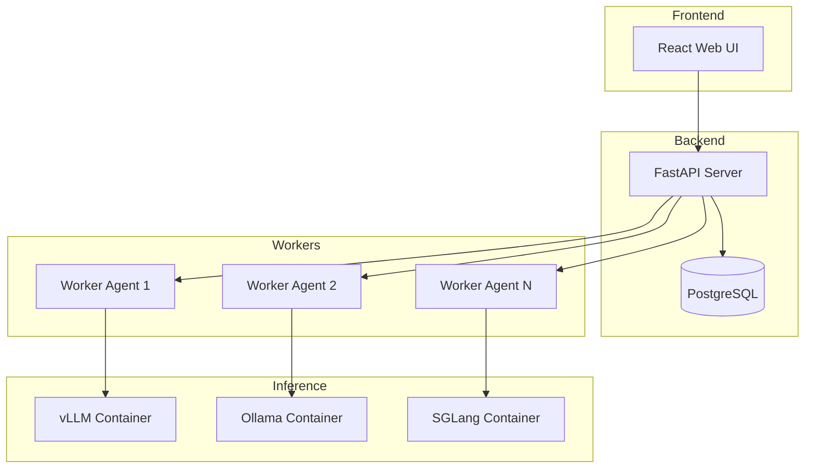

# LMStack

**LLM Deployment Management Platform**

LMStack is a comprehensive platform for deploying, managing, and monitoring Large Language Models (LLMs) across distributed GPU workers. It provides a unified interface for managing multiple inference backends including vLLM, Ollama, and SGLang.

## Key Features

- **Multi-Backend Support**: Deploy models using vLLM, Ollama, or SGLang backends
- **Distributed Workers**: Manage GPU workers across multiple nodes
- **OpenAI-Compatible API**: Drop-in replacement for OpenAI API
- **Real-time Monitoring**: Track deployments, GPU usage, and container health
- **Web-based Chat**: Interactive chat interface for testing models
- **API Key Management**: Secure API access with key-based authentication

## Architecture Overview

## Quick Links

- [Installation Guide](getting_started/installation.md) - Get LMStack up and running
- [Quick Start](getting_started/quickstart.md) - Deploy your first model
- [API Reference](api_reference/index.md) - Complete API documentation
- [Contributing](development/contributing.md) - Help improve LMStack

## Supported Backends

| Backend | GPU Support | CPU Support | Quantization |
|---------|-------------|-------------|--------------|
| vLLM    | ✅          | ❌          | AWQ, GPTQ    |
| Ollama  | ✅          | ✅          | GGUF         |
| SGLang  | ✅          | ❌          | AWQ, GPTQ    |

## License

LMStack is open-source software licensed under the MIT License.
